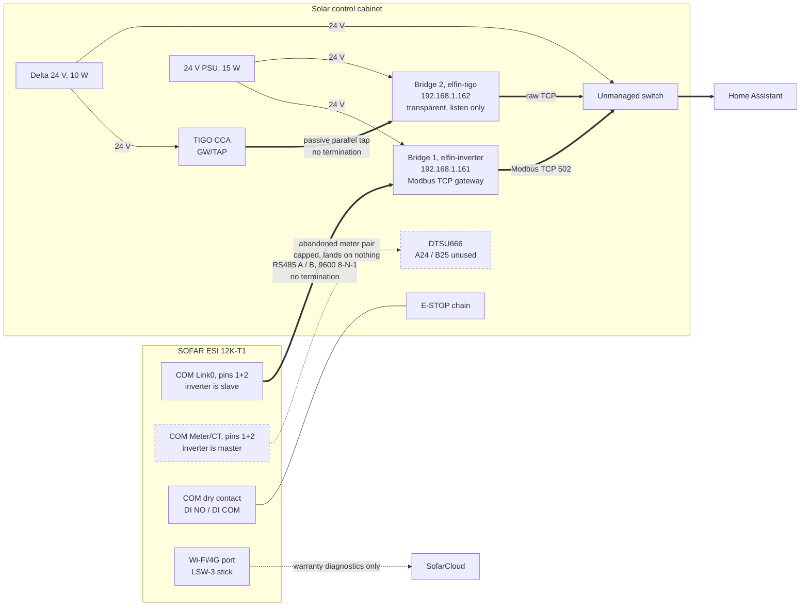

# SOFAR ESI 12K-T1: Home Assistant Integration

Local Modbus control of the inverter, with no cloud in the automation path.

For the plant itself (array, battery, enclosure, network addresses) see
[`pv-battery-plant.md`](pv-battery-plant.md). For what was probed and ruled out, see
[`sofar-modbus-findings.md`](sofar-modbus-findings.md). For the decisions, see ADR 0007
(control never over the stick) and ADR 0008 (nothing at all over the stick).

> **Read off the actual inverter on 2026-08-21**, over the wired bridge. The register map
> below was inherited research until then, and the battery block in it was wrong: the
> whole `0x02xx` range is unimplemented on this firmware. Addresses corrected here have
> been verified against the hardware. Anything not marked as verified is still inherited.

## Protocol lineage

The ESI 12K-T1 belongs to the "SOFAR HYD-3PH and SOFAR-G3" protocol family, per the
official SOFAR Modbus User Guide v1.29 (July 2023). That guide covers ESI 2.5-12K-T1,
HYD 5-20KTL-3PH, HYD 3-6K-EP, and the KTL-G3 string inverters. **Register addresses
are identical between the ESI and the HYD three-phase models.** Anything that works
against a HYD 10KTL-3PH works here.

The older "SOFAR HYD 3-6K-ES / ME3000SP" protocol, which `plugin_sofar_old` targets,
is a different register map and does not apply. The correct plugin is `plugin_sofar`,
the G3 and three-phase variant.

No integration lists the ESI 12K-T1 explicitly. Community reports confirm the family
works: a user brought up an ESI 6K-S1 on `homeassistant-solax-modbus` by adding its
serial prefix to `plugin_sofar.py`, and another confirmed `ha-solarman` against an ESI
hybrid using the `sofar_g3hyd.yaml` profile. Neither was a 12K-T1, but the protocol is
shared.

## Transport

One path. A wired Elfin EE11A on the inverter's Link0 monitoring bus.

| Path | Use | Status |
|---|---|---|
| Elfin EE11A on the inverter's Link0 monitoring bus | Everything | Live at `192.168.1.161:502` since 2026-08-21 |
| LSW-3 Wi-Fi logger stick, `192.168.1.6:8899` | Nothing. SofarCloud only | Ruled out, see findings |

The stick was originally intended to carry monitoring while the wired bridge carried
control, on the reasoning in ADR 0007: reads degrade honestly over a lossy link, writes
degrade silently, and a Passive Mode write that fails invisibly makes the battery do
the wrong thing at the wrong hour of a winter evening.

That reasoning still holds and still governs. What changed is that the stick turned out
to serve nothing locally at all. Port 8899 is open and accepts connections, but answers
neither Modbus in two framings nor Solarman V5 addressed with the correct logger
serial. Its working mode is Data collection, in which the cloud-polling process owns
the RS485 port, and its internal TCP server is bound to the access-point-side address
rather than the LAN one. See
[`sofar-modbus-findings.md`](sofar-modbus-findings.md) for the probes and evidence.

Transparency mode on the stick would work, at the cost of disabling SofarCloud and
limiting it to one client. Rejected in ADR 0007 and again in ADR 0008: the cloud portal
is how the installer would remote-diagnose a warranty claim, and the handover is signed,
so warranty is the only recourse left.

### Wiring the bridge

The COM port is not a pin block. It is a bank of six RJ45 jacks plus a dry-contact
terminal, and two of those jacks carry RS485 in opposite master/slave roles.

| Jack | Pin 1 (orange/white) | Pin 2 (orange) | Inverter's role |
|---|---|---|---|
| Meter/CT | Meter RS485 A | Meter RS485 B | Master, polls the DTSU666 |
| Link0 / Link1 | Upper computer RS485 A | Upper computer RS485 B | Slave, answers an external master |

**The bridge lands on Link0.** "Upper computer" is the vendor's term for a host or SCADA
master, so that is the slave-side monitoring bus. Anything attached to Meter/CT competes
with the inverter for the bus instead of being answered by it.



Thick edges are the RS485 and Modbus data path. Dashed is abandoned or cloud-only.
The two bridges run **opposite modes**: bridge 1 is an active master that polls the
inverter, bridge 2 is a silent listener on a bus the CCA already masters. Nothing may
ever write to bridge 2's socket, because transparent mode will push whatever it receives
onto the bus and collide with the CCA.

Because both buses use pins 1 and 2 of an RJ45, a cable moves between them unchanged.
The pair the installer ran for the meter was repurposed by moving its plug from Meter/CT
to Link0, so no new cable and no crimping were needed. Serial is 9600/8-N-1.

**No termination and no separate ground conductor on this link.** At 9600 baud over a few
metres a reflection settles within about 0.03 percent of a bit period, so termination is
not merely redundant: two 120 ohm resistors put 60 ohm across the pair and fight the
receivers' failsafe bias, which produces the intermittent framing errors it was supposed
to prevent. Both ends already share protective earth, so a ground conductor would add a
loop path rather than remove a common-mode offset. If CRC errors ever do appear, adding a
resistor across A and B at the bridge is a two-minute change.

If the inverter does not answer at all, swap A and B before investigating anything else.
Reversed polarity presents as total silence rather than corruption.

**Use the EE11A, not the plain EE11.** The EE11 accepts 5-18 VDC; the enclosure's Delta
supply is 24 V. Only the EE11A spans 5-36 VDC and can be fed directly from the existing
rail. The heat pump's EW11A is the same variant for the same reason.

**Do not add termination to the TIGO CCA tap.** That bridge is a passive parallel tap
onto a bus already terminated at both ends. A third resistor loads the bus and degrades
the CCA's own traffic. Termination applies to the inverter link only.

## Integration choice

`homeassistant-solax-modbus` (wills106, via HACS), configured against the wired bridge
from its first connection.

Its only interfaces are `tcp` and `serial`, both plain Modbus. The source contains no
reference to Solarman or V5 anywhere, so it was never able to talk to the stick in its
current mode, and the transferred research claiming otherwise was wrong.

`ha-solarman` is **not** a fallback. It speaks Solarman V5, which is exactly the
protocol the stick refuses to answer, so it fails for the same reason everything else
on 8899 does. It would only become relevant if the stick were put into Transparency
mode, which both ADRs reject.

Because there is now only ever one transport, the entity-churn concern that shaped the
original integration choice no longer applies. There is nothing to migrate from.

### Serial prefix: already supported, no patch needed

This unit's serial begins `SH1`, which `plugin_sofar.py` already recognises:

```python
elif seriesnumber.startswith("SH1"):
    invertertype = HYBRID | X3 | GEN | BAT_BTS  # HYD5...8KTL-3P
```

The flags are correct for this hardware. `HYBRID` because there is a battery, `X3` for
three-phase, `GEN` for the G3 protocol generation, and `BAT_BTS` which matches the
SOFAR BTS pack actually installed. The plugin reads the serial from register `0x445`.

Earlier planning assumed a one-line patch would be needed and that HACS would clobber
it on every update. Neither applies. The install is stock.

The upstream comment guesses the model as a HYD 5-8KTL-3P, so the device entry may
display a model name that is not ESI 12K-T1. That is a label, not behaviour: the ESI
and HYD three-phase models share the register map.

## Register map

Function code `0x03` for reads, `0x10` for writes. Big endian. Scale factors apply to
raw values.

### Monitoring (read-only)

**The whole `0x02xx` block is unimplemented on this firmware.** A read of `0x0200`,
`0x020D`, `0x0210` or `0x0211` returns Modbus exception 2, illegal data address, while
the `0x04xx`, `0x05xx` and `0x06xx` blocks answer normally. The battery rows below were
originally inherited from HYD research pointing at `0x02xx`; they are corrected here to
the addresses the hardware actually serves, read off the plant on 2026-08-21 over the
wired bridge.

The battery readings were cross-checked rather than assumed: `0x0604` x `0x0605` gives
412.2 V x 8.14 A = 3355 W, which matches `0x0606` at 3350 W, and `0x0608` read 87 while
the operator independently reported the pack at 87 percent. Every address below was then
confirmed a second time against the entities `homeassistant-solax-modbus` produces once
it is running, which map one-to-one onto this table.

| Parameter | Hex | Dec | Type | Scale | Unit |
|---|---|---|---|---|---|
| PV1 Voltage | 0x0584 | 1412 | U16 | x0.1 | V |
| PV1 Current | 0x0585 | 1413 | U16 | x0.01 | A |
| PV1 Power | 0x0586 | 1414 | U16 | x10 | W |
| PV2 Voltage | 0x0587 | 1415 | U16 | x0.1 | V |
| PV2 Current | 0x0588 | 1416 | U16 | x0.01 | A |
| PV2 Power | 0x0589 | 1417 | U16 | x10 | W |
| Battery Voltage | 0x0604 | 1540 | U16 | x0.1 | V |
| Battery Current | 0x0605 | 1541 | I16 | x0.01 | A |
| Battery Power | 0x0606 | 1542 | I16 | x10 | W (+ charge, - discharge) |
| Battery Temperature | 0x0607 | 1543 | U16 | 1 | C |
| Battery SOC | 0x0608 | 1544 | U16 | 1 | % |
| Battery SOH | 0x0609 | 1545 | U16 | 1 | % |
| Battery Cycle Count | 0x060A | 1546 | U16 | 1 | cycles |
| Battery Temperature | 0x0608 | 1544 | I16 | 1 | C |
| Battery Cycles | 0x0212 | 530 | U16 | 1 | cycles |
| Grid Total Power (PCC) | 0x0488 | 1160 | I16 | x10 | W (+ export, - import) |
| Grid Frequency | 0x0484 | 1156 | U16 | x0.01 | Hz |
| Inverter Output Power | 0x0485 | 1157 | I16 | x10 | W |
| L1 / L2 / L3 Voltage | 0x048D / 0x0498 / 0x04A3 | 1165 / 1176 / 1187 | U16 | x0.1 | V |
| L1 / L2 / L3 Grid Power | 0x0493 / 0x049E / 0x04A9 | 1171 / 1182 / 1193 | I16 | x10 | W |
| Inverter Temperature | 0x0418 | 1048 | I16 | 1 | C |
| Operating Status | 0x0404 | 1028 | U16 | - | enum |

### Control (read/write)

| Parameter | Hex | Dec | Type | Values / Scale |
|---|---|---|---|---|
| Energy Storage Mode | 0x1110 | 4368 | U16 | 0 Self Use, 1 TOU, 2 Timing, 3 Passive, 4 Peak Shaving |
| Passive: Desired Grid Power | 0x1187-0x1188 | 4487-4488 | I32 | Watts (+ import, - export) |
| Passive: Max Battery Power | 0x1189-0x118A | 4489-4490 | I32 | Watts |
| Passive: Min Battery Power | 0x118B-0x118C | 4491-4492 | I32 | Watts |
| Active Power Export Limit | 0x1106 | 4358 | U16 | x0.1 %Pn (volatile) |
| Power Control Enable | 0x1105 | 4357 | U16 | bitfield (volatile) |
| Export Surplus Limitation | 0x1023-0x1024 | 4131-4132 | U16 | enable plus kW limit |

### Energy counters (read-only, 32-bit)

| Parameter | Hex | Type | Scale |
|---|---|---|---|
| PV Generation Today | 0x0684-0x0685 | U32 | x0.01 kWh |
| PV Generation Total | 0x0686-0x0687 | U32 | x0.1 kWh |
| Grid Import Total | 0x068E-0x068F | U32 | x0.1 kWh |
| Battery Discharge Total | 0x0228-0x0229 | U32 | x0.1 kWh |

## Passive Mode

Writing `3` to `0x1110` enables it. The three I32 pairs at `0x1187` through `0x118C`
then set the grid power target and the battery charge and discharge limits.

Three things matter here:

1. **These are volatile registers**, held in RAM. They are safe to write continuously
   without EEPROM wear. The rest of the register space is not: the EEPROM is rated
   around 100,000 write cycles, so mode changes must be written only when the mode
   actually needs to change, never on a short timer.
2. **They must be written as a block** of six registers starting at `0x1187` using
   function code `0x10`. The native Home Assistant Modbus integration defaults to
   `0x06`, write single register, which will not work. `solax-modbus` handles the
   batching through dedicated update button entities.
3. **There is a two-minute commitment window** after values change.

The upstream documentation recommends driving Passive Mode from Home Assistant rather
than using the inverter's own Time of Use or Timing modes, which are limited.

## Storage modes

| Mode | Behaviour |
|---|---|
| Self Use | Default. Household consumption first, battery absorbs excess PV |
| Time of Use | Up to four schedule rules on time intervals and SOC targets |
| Timing | Fixed times for charge and discharge at set power levels |
| Passive | Full external control. Three parameters, two-minute commitment window |
| Peak Cut | Shaves grid demand peaks |
| Off-Grid (EPS) | Backup during outages |

## Island mode

The ESI 12K-T1 supports three-phase island operation as a hardware feature, and it was
tested and witnessed at handover. The Modbus registers for enabling and disabling it
are not documented in public sources. EPS configuration registers exist in the `0x1000`
range but are normally set from the inverter's LCD menu or the installer app rather
than over Modbus. Treat island mode as out of scope for automation until someone maps
those registers.

## Energy dashboard

Home Assistant's energy configuration is not reachable through `ha-mcp`. It lives in
`.storage/energy` behind the `energy/save_prefs` websocket call, so the mapping is set by
hand under Settings, Dashboards, Energy.

| Section | Entity |
|---|---|
| Grid consumption | `sensor.utility_sofar_inverter_import_energy_total` |
| Return to grid | `sensor.utility_sofar_inverter_export_energy_total` |
| Solar panels | `sensor.utility_sofar_inverter_solar_generation_total` |
| Battery, energy going in | `sensor.utility_sofar_inverter_battery_input_energy_total` |
| Battery, energy coming out | `sensor.utility_sofar_inverter_battery_output_energy_total` |

Use the `_total` sensors, never the `_today` ones. The dashboard wants monotonic lifetime
counters and derives daily figures itself; a sensor that resets to zero at midnight
corrupts its statistics.

Two things not to be caught by. The `ed_mapping_present` attribute these sensors carry is
**not** a way to check whether the mapping took: it reads `false` even on sensors the
energy dashboard is demonstrably using. Read the dashboard itself instead. And the history
starts the day the entities are created and cannot be backfilled, because Home Assistant
has no long-term statistics from before they existed. The lifetime counters arrive already
populated, but the hourly shape of everything earlier lives only in SofarCloud.

The integration also ships a separate `Sofar Energy Dashboard` device carrying three
switches that gate optional sensors. Home Consumption and Grid to Battery are on; PV
Variant Detail is off, because per-string power is already exposed and TIGO covers
per-panel. Home Consumption produces
`sensor.utility_sofar_inverter_load_consumption_total`, which the energy dashboard does
not consume directly (it derives consumption from the other flows) but which is useful
elsewhere. Grid to Battery produces nothing while the inverter runs Self Use, since the
battery only ever charges from surplus; expect those sensors to appear once Passive Mode
starts charging from the grid across **Blok** boundaries.

The figures reconcile against each other. Taking a reading on 2026-08-21: 864.7 kWh
generated, 529.4 exported, 145.7 into the battery and 110.4 back out, 3.4 imported, with
about 17 kWh still stored at 92 percent SOC. That leaves roughly 18 kWh of battery
round-trip loss and about 58 kWh unaccounted against a reported load of 245.1 kWh, which
is near 7 percent of generation and is the conversion loss the utility room feels as
**plant heat**.

**Treat grid import with suspicion until it is checked against the utility meter.** The
DTSU666 is bypassed, so the inverter measures grid exchange with its own internal CTs and
there is no independent meter to cross-check. A lifetime import of 3.4 kWh against 529.4
kWh exported is plausible for a young plant in August with 13.65 kWp and 18.5 kWh usable
storage, but it is also exactly what would appear if those CTs measure only what passes
through the inverter rather than the whole house at the point of connection. If the two
diverge over a few days, restoring the meter stops being out of scope.

## Plan

There is no cheap interim step. Nothing happens in Home Assistant until the bridge is
wired, so the plan is two stages, not three.

**Stage 1, monitoring and control together.** Wire the EE11A to the inverter's Link0 jack,
pins 1 and 2, with no termination. Power it from its own 24 V supply rather than the Delta,
which already carries the TIGO CCA and the switch on a 10 W budget. Give it a static
address plus a DHCP reservation, and record both here and in the network doc. Install
`homeassistant-solax-modbus` via HACS and point it at the bridge. No code editing, the
`SH1` prefix is handled upstream. Confirm entities enumerate and the energy dashboard
populates before writing anything. Once reads are stable, Passive Mode control can
start, because writes over this transport report honestly.

**Stage 2, optimizer telemetry.** Passive parallel RS485 tap on the TIGO CCA's GW/TAP
port, using the second EE11A. No termination on this one. Per-panel visualisation via
the Solar Panel Visualizer Lovelace card.

The tap bridge went live on 2026-08-26 at `192.168.1.162`, serving the bus on port 7160.
The route into Home Assistant is settled in ADR 0013: `taptap-mqtt` behind a Mosquitto
broker, both Ansible-managed on the containers VM, with the add-on image run as an
ordinary container. The broker blocker recorded here previously is resolved.

**The CCA keeps its internet connection**, reversing what this section used to say. That
line predated the discovery that TIGO EI is the only source of the panel-to-serial
mapping - nothing on the bus carries panel position. The portal also stays the day-one
cross-check for decoded values and the warranty-diagnosis channel, which is the same
reasoning that kept SofarCloud alive in ADR 0007 and 0008.

> **Prerequisite on stage 2**: capture all 30 optimizer serials with their panel
> positions from TIGO EI before first deploy. Serials are optional in the bridge config,
> but omitting them makes it assign discovered modules to randomly picked names, so the
> data comes out confidently mislabelled rather than merely unlabelled, and cannot be
> repaired retroactively.

## Gotchas

- **Turn the battery pack sweep off, or no sensors appear at all.** With it enabled the
  integration loops over battery packs reading a per-pack serial that this inverter does
  not serve, and the sensor platform blows through its 60 second startup budget. HA logs
  `cannot get serial for batt_nr: 0, batt_pack_nr: 0`, then `Setup of platform
  solax_modbus is taking longer than 60 seconds`, and you end up with buttons, numbers and
  selects but zero sensors. The other platforms set up fine, which makes it look like a
  partial success rather than a stall. Disabling the sweep brings all 91 sensors up
  immediately. This is not a transport problem: every Modbus read on this bridge returns
  in under 0.2 seconds, including the ones that fail.
- **Per-pack battery data is not on Modbus.** SofarCloud shows all four BTS-5K packs
  individually with serial, BMS version, voltage, current, power and SOC. None of that is
  reachable over the wired bridge: a sweep of `0x0000` to `0x2000` finds the ASCII marker
  `SH` exactly once, at `0x0445`, which is the inverter's own serial. The pack serials
  (`SH2004400VE...`) appear nowhere. Only the aggregate at `0x0604` to `0x060A` is
  available locally. If per-pack telemetry is ever needed, the cloud is the only source.
- The logger stick answers nothing on 8899 despite the port being open. Do not spend an
  evening on it; read the findings document first.
- The EEPROM has a finite write-cycle budget. Only the Passive Mode registers and the
  two power-control registers marked volatile are safe for frequent writes.
- Passive Mode needs block writes via `0x10`. Single-register writes will not take.
- Transparency mode on the stick kills SofarCloud and allows one client. Not worth it
  while warranty diagnostics matter.
- Use the EE11A. The plain EE11 tops out at 18 VDC and the enclosure rail is 24 V.
- The device entry may show a HYD model name rather than ESI 12K-T1, because upstream
  maps the `SH1` prefix to the HYD three-phase family. Cosmetic only.
- Published firmware guidance for these sticks and inverters uses a different
  versioning scheme than the strings this unit reports. Do not assume thresholds like
  V110051 apply.
