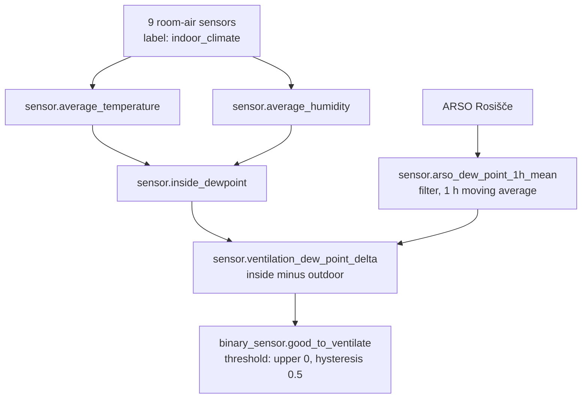

# Ventilation Reminder (Humidity)

Notifies home users to open windows when indoor humidity is high and outdoor air is
drier than indoor air.

## Entities

| Entity | Type | Purpose |
|--------|------|---------|
| `automation.remind_to_ventilate` | Automation | Sends the initial notification |
| `automation.update_ventilation_notification` | Automation | Re-sends every 2 min for live update |
| `automation.clear_ventilation_notification` | Automation | Clears, and snoozes on Urejeno |
| `input_boolean.ventilation_reminder_active` | Helper | Whether a notification is displayed |
| `input_datetime.ventilation_snoozed_until` | Helper | Suppresses sends until this moment |
| `binary_sensor.good_to_ventilate` | Threshold helper | Hysteresis over the dew point delta |
| `sensor.ventilation_dew_point_delta` | Template sensor | Indoor dew point minus smoothed outdoor |
| `sensor.arso_dew_point_1h_mean` | Filter helper | 1 h moving average of the ARSO dew point |
| `sensor.inside_dewpoint` | Template sensor | Magnus-Tetens over the house averages |
| `sensor.average_temperature` | Template sensor | Mean of `indoor_climate` temperature sensors |
| `sensor.average_humidity` | Template sensor | Mean of `indoor_climate` humidity sensors |

## Signal chain



`good_to_ventilate` turns **on** above +0.5 K and **off** below -0.5 K. Between those it
holds, which is what stops the chattering.

## Flow

```
Trigger: 07:30 / 12:30 / 19:30 OR good_to_ventilate turns on
  -> Conditions: good_to_ventilate on
                 AC in off / fan_only / heat
                 average_humidity > 50
                 no ventilation_window open
                 now() >= ventilation_snoozed_until
  -> Send sticky live-update notification
  -> Turn on input_boolean.ventilation_reminder_active

Every 2 minutes, same conditions: re-send with the current humidity (same tag)

Clear on any of:
  humidity below 50 | good_to_ventilate off | a ventilation_window opens
  | Urejeno tapped | notification swiped away

Urejeno additionally sets ventilation_snoozed_until to the next 07:30 / 12:30 / 19:30
```

## Why the house averages use a whitelist label

`sensor.average_temperature` and `sensor.average_humidity` average exactly the entities
carrying the `indoor_climate` label. They used to sweep every `device_class: temperature`
entity not on floor `Zunaj` and not labelled `Outside`.

That sweep broke when TIGO and SOFAR telemetry arrived. It grew to 51 sensors of which
only 9 were rooms: 30 rooftop PV panel temperatures, 5 string aggregates, 7 inverter
internals (two of them reporting a literal `0`), and the ARSO outdoor UTCI. Hourly
statistics show `sensor.average_temperature` peaking at **47.0 C** on 2026-08-27 and
**46.3 C** on 2026-08-28, tracking the roof rather than the house. `inside_dewpoint` is
computed from it, so it reported an indoor dew point of 38-39 C.

The line that matters is not indoor versus outdoor. An inverter heatsink at 38 C sits in
the utility room and is still irrelevant, so no blacklist keyed on "outside" can express
it. See ADR 0011, and **room-air sensor** / **apparatus sensor** in `CONTEXT.md`.

Adding a room means labelling its two entities `indoor_climate`. Nothing else changes.
`unavailable` members are skipped, so a dead battery drops a room out and it rejoins by
itself.

## Why this smooths the input where free cooling uses a deadband

The utility room's **free cooling** rule compares dew points with a bare 1 K deadband, and
`utility-climate.md` explains it cannot oscillate: opening that window pulls `dp_utility`
toward outdoor, which moves the comparison further *inside* the deadband.

Whole-house ventilation is the mirror image. Opening house windows pulls the house average
*down toward* outdoor, driving `arso < inside` toward false. It is self-terminating, not
self-stabilising, so the property that lets free cooling survive on one threshold does not
hold here.

A deadband would not have been enough anyway. The ARSO dew point moves 1 to 2 K within a
single hour, occasionally 3 K, being an airport reading 25 km away. Observed within-hour
spreads over four days: 0.4, 1.2, 1.5, 1.5, 1.6, 2.0, 2.0, 3.0 K. Any band wide enough to
absorb that would be wide enough to miss the weather, so the input is smoothed to an hourly
mean first and the band kept narrow at 0.5 K.

The band is centred on zero. It is deliberately **not** shifted to absorb the roughly 1 K
station bias measured in `utility-climate.md`: that came from one 9 h stretch in a different
room with the window open, and applying it here would make the reminder fire *more*.

## Why the window gate excludes the utility window

The gate suppresses the reminder while any entity labelled `ventilation_window` is open.
Today that is the Lukova soba window; labelling a new sensor adds it with no config change.

`binary_sensor.utility_okno` is deliberately excluded. It is the free-cooling purge path
and was open about 80% of one sample week, including 07:30 on **8 of 8** sampled mornings.
An OR gate including it would not filter the morning reminder, it would delete it.

## Notification

- **Tag**: `humidity_alert`
- **Title**: "Visoka vlaga"
- **Features**: `live_update`, `persistent`, `sticky: "true"`, `alert_once: true`
- **Deep link**: `clickAction: /climate`
- **Action button**: "Urejeno" (`MARK_DONE`)

`alert_once` suppresses re-alerting on an *update* to a live tag. It does not cover a first
send after a clear, which is why a flapping sensor used to buzz on every cycle and why
`MARK_DONE` now snoozes instead of only clearing.

## Outdoor data sources

1. **ARSO** `sensor.arso_weather_letalisce_jozeta_pucnika_ljubljana_rosisce`, smoothed
   through `sensor.arso_dew_point_1h_mean`
2. **Met.no** `weather.forecast_home` -> `dew_point` attribute, fallback inside
   `sensor.ventilation_dew_point_delta`

With neither available the delta sensor is unknown and the threshold holds its last state.
