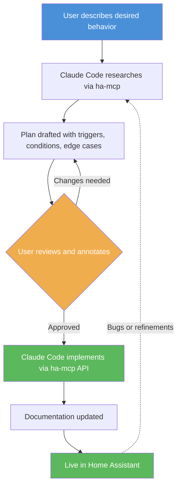

# Managing Home Assistant with Claude Code

This document describes the workflow and tooling used to manage a Home Assistant (HAOS) instance through Claude Code, Anthropic's AI-powered CLI assistant. It covers the integration architecture, documentation practices, the types of work achieved, established patterns, and a worked example.

## Toolchain

### HA-MCP (Home Assistant MCP Server)

The core integration is **[ha-mcp](https://github.com/homeassistant-ai/ha-mcp)**, a Docker container deployed via Ansible that exposes the Home Assistant API as an MCP (Model Context Protocol) server. MCP is a protocol that lets AI assistants call external tools — in this case, it exposes the HA REST API as discrete operations (read entity state, create automation, update script, etc.) that Claude Code can invoke directly during a conversation.

Because the HA instance runs on **HAOS** (Home Assistant Operating System), it is not SSH-managed and cannot be targeted by Ansible playbooks. The MCP server is the sole programmatic bridge between Claude Code and Home Assistant. No HA YAML files are edited directly; all changes go through the API.

### Ansible

The ha-mcp server itself is provisioned and configured through an Ansible role (`roles/ha_mcp`), with secrets managed via Ansible Vault. The deployment follows the same patterns as all other services in the homelab — Docker Compose templates, health checks, and Traefik integration.

### Claude Code

[Claude Code](https://claude.ai/claude-code) is Anthropic's CLI tool that puts Claude (the LLM) in a terminal session with access to the filesystem, shell commands, and MCP integrations. In this workflow, it serves as the operator — querying entity states through ha-mcp during research, proposing automation logic during planning, creating the automations via API calls, and updating documentation files. The typical cycle is research-plan-implement with user review at each stage.

## Documentation Practices

Every automation domain has a dedicated documentation file under `docs/home-assistant/automations/`. These files capture the intent, entity mappings, trigger logic, edge cases, and gotchas for each automation — the information that is not obvious from reading the automation configuration alone.

Dashboard documentation lives under `docs/home-assistant/dashboards/` (e.g., `air-quality.md`).

Documentation is updated at the same time as the automation it describes — never deferred to a later session.

## Typical Workflow

1. **The user describes the desired behavior** — e.g., "notify me when mold risk is high" or "automate my room blinds based on sun position."
2. **Claude Code researches** — queries entity states, device capabilities, and existing automations through ha-mcp to understand what is available.
3. **A plan is drafted** — trigger logic, conditions, edge cases, and entity mappings are laid out for review.
4. **The user reviews and annotates** — corrections, additional requirements, and edge cases are incorporated. This loop may repeat multiple rounds.
5. **Claude Code implements** — automations, helpers, scripts, and dashboard cards are created through ha-mcp API calls.
6. **Documentation is updated** — the relevant doc file under `docs/home-assistant/automations/` is created or updated with the full context.
7. **Iteration continues** — bugs, edge cases, and refinements are addressed in follow-up sessions, feeding back into the research phase.

## What This Workflow Has Produced

### Automations Built from Scratch

- Mold risk detection with sustained-duration filtering
- Presence simulation for away periods
- Air quality monitoring with push notifications and dashboard deep links
- Blinds management consolidated from multiple automations into single `choose`-based automations with sun elevation triggers
- Humidity and air quality-driven ventilation control
- Motion light consolidation (multiple rooms)
- AC filter replacement reminders
- Proxmox update notifications with auto-update detection and notification clearing
- Battery, 3D printer, and infrastructure monitoring alerts

### Iterative Fixes and Refinements

- Debouncing oscillating sensor triggers to prevent notification spam
- Correcting Android notification deep links (`clickAction` instead of `url`)
- Adding sustained-duration filters (e.g., 2-hour mold risk threshold)
- Adjusting ventilation notification logic for AC heat mode
- Correcting entity IDs in blind and notification automations

### Notification System

All user-facing notifications route through a central notification script, which handles home/away user filtering and supports clearing stale alerts. Every push notification automation uses a unique `tag` value to enable live updates and dismissal.

## Worked Example: Room Blinds and Window Ventilation

This example illustrates the full workflow applied to a real automation set. The goal was to automate bedroom blinds based on sun position and window state, consolidating what had been separate open/close automations into smarter, context-aware ones.

### What Was Built

Two automations that work together:

**`automation.bedroom_blinds`** — a single `choose`-based automation with three trigger paths:

- **Wake-up open**: When the Aqara P1 motion sensor detects motion after 06:30 and before noon, with the sun above the horizon and the blinds mostly closed (position < 50%), the blinds open. This ties the blinds to actual wake-up activity rather than a fixed schedule.
- **Fallback open**: When sun elevation crosses above 10°, the blinds open regardless of motion. This ensures blinds open even when nobody is home or the motion sensor misses the wake-up.
- **Evening close**: At sunset + 1 hour, the blinds close — but only if the window is not open, so the ventilation automation is not fighting the blinds automation.

**`automation.window_ventilation_control`** — when the IKEA MYGGBETT window sensor detects the window opening, this automation saves the current blind position as a scene snapshot and tilts the blind open by +3% to allow airflow without fully opening. When the window closes, the saved position is restored — unless it is nighttime (sun below horizon), in which case the blind fully closes.

### Edge Cases Addressed in Planning

- **Nighttime bathroom trips**: The `sun elevation > 0°` guard on the motion trigger prevents blinds from opening when motion is detected at 3am.
- **Ventilation tilt state**: The condition checks `position < 50` instead of `state: closed`, because the ventilation automation may have tilted the blind to +3% — which changes the position but not the state.
- **Window open at sunset**: The evening close trigger skips when the window is open, deferring to the ventilation automation to handle the blind when the window eventually closes.
- **Nighttime window close**: If the window closes after dark, the blind fully closes rather than restoring a daytime snapshot that would leave it partially open.

### Iteration History

The automation went through several rounds of refinement:

1. Originally implemented as two separate automations (one for open, one for close)
2. Consolidated into a single `choose`-based automation for easier maintenance
3. A bug was found and fixed where the wrong blind entity ID was referenced
4. The window ventilation automation was added as a companion to handle the interaction between airflow needs and blind position
5. All changes were documented in `docs/home-assistant/automations/blinds.md`

This progression — from initial implementation through consolidation, bug fixes, and interaction handling — is representative of how most automations evolve across sessions.
