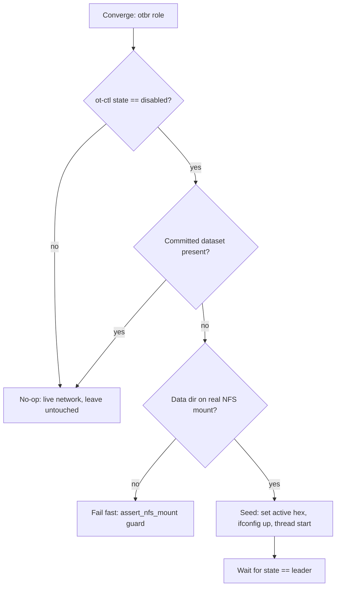

# OTBR Thread dataset capture, restore, and migration

Reference plus how-to for the OpenThread Border Router (OTBR) Thread-network
recovery feature. Covers what the Active Operational Dataset is, why we vault
the full hex-TLV (not just the human-readable fields), how the role seeds a
blank store, and the runbook for migrating the live OTBR onto `/opt/otbr`.

The role code is owned by `ansible/roles/otbr/`. This doc owns the operator
runbook and the rationale.

## Topology

- **OTBR** runs as a Docker container named `otbr` on the `containers` VM
  (`192.168.1.140`), driving the USB SONOFF RCP radio. The Thread dataset is
  persisted in the container at `/var/lib/thread`, bind-mounted from
  `/srv/docker/otbr/data` on the host.
- **matter-server** runs separately on `rpi4`. It is the Matter fabric
  controller; OTBR is only the Thread border router. They are split across
  hosts to avoid the mDNS port-5353 conflict (see the repo Known Issues).

## Overview: the dataset is the network identity

A Thread network is defined by its **Active Operational Dataset**. otbr-agent
stores it as a single hex-encoded TLV blob, but it decomposes into 10 fields:

| TLV | Role | Secret |
| --- | --- | --- |
| Active Timestamp | Versioning of the dataset; bumps on every change | no |
| Channel | 2.4 GHz channel (15 here) | no |
| Channel Mask | Allowed channels for channel agility | no |
| Ext PAN ID | 8-byte extended PAN identifier (`1111111122222222`) | no |
| Mesh-Local Prefix | `fd..` ULA prefix all mesh-local addresses derive from | no |
| Network Key | 16-byte master key; gates layer-2 join | YES |
| Network Name | Human label (`OpenThreadHA`) | no |
| PAN ID | 16-bit short PAN identifier (`0x1234`) | no |
| PSKc | Pre-Shared Key for the Commissioner | YES |
| Security Policy | Rotation timer and join-permission flags | no |

The dataset is the network's identity. Two border routers that load the same
dataset are the same Thread network; load a different dataset and you have a
different network that commissioned devices cannot reach.

### Why we vault the full TLV, not the five descriptive fields

It is tempting to store only the five fields you can eyeball (channel, network
name, PAN ID, ext PAN ID, network key) and rebuild the dataset from them. That
is wrong and it is a re-commission-class break.

Rebuilding from the five descriptive fields **randomizes PSKc and the
Mesh-Local Prefix**, because they are not derived from those five inputs:

- **PSKc** is generated fresh unless supplied. A changed PSKc breaks future
  commissioning sessions.
- **Mesh-Local Prefix** is a connectivity-bearing field. Every device's
  mesh-local address (`fd..`) derives from it. Change the prefix and every
  already-commissioned Matter device is orphaned. Recovery is re-commissioning
  each device, by hand, one at a time.

The full hex-TLV is the only artifact that reconstitutes the network
**byte-for-byte**. So we vault the whole blob:

- Vault key: `vault_thread_active_dataset`
- Role alias: `otbr_thread_active_dataset`

The value is a secret. The Network Key and PSKc live inside it, so it belongs
in `ansible-vault`-encrypted `secrets.yml` and nowhere else.

## Capture (bootstrap, one-time)

Capture the live dataset off the running border router and store it in vault.
Do this once, before relying on the restore path.

1. Read the active dataset as hex on the `containers` host:

   ```bash
   sudo docker exec otbr ot-ctl dataset active -x
   ```

   The `-x` flag prints the full hex-TLV (a single long hex line). Copy it.

2. Edit the vault and add the key:

   ```bash
   cd ansible
   ansible-vault edit secrets.yml
   ```

   Add:

   ```yaml
   vault_thread_active_dataset: "<paste the hex here>"
   ```

This blob contains the Network Key and PSKc. Treat it as a credential: it only
ever lives encrypted in `secrets.yml`. Do not paste it into a chat, a ticket,
or an unencrypted file.

## Seed-on-empty behavior and the guard

On every converge the role decides whether to restore the vaulted dataset. It
restores **only** when all of these hold:

1. `ot-ctl state` reports `disabled` (the agent is not on a network); AND
2. no committed dataset is present in the store; AND
3. the data dir (`/srv/docker/otbr/data`) is on a real NFS mount, verified by
   the role's own `assert_nfs_mount` guard.

On a populated or live store the restore is a **safe no-op**: a committed
dataset is present, so condition 2 fails and the role does nothing destructive.

When all three conditions hold, the seed attach sequence is:

```text
ot-ctl dataset set active <hex>   # load the vaulted dataset
ot-ctl ifconfig up                # bring the Thread interface up
ot-ctl thread start               # start the Thread stack
# wait until: ot-ctl state == leader
```



### Why this is safe (and the one residual risk)

otbr-agent does **not** self-form a network on an empty store. It sits
`disabled` until something hands it a dataset. So an empty border router will
not silently invent a brand-new random network on its own.

The only "wrong network" risk is Home Assistant's `otbr` integration pushing
**its** preferred dataset to a blank border router during the window where the
store is empty and the agent is `disabled`. We mitigate this two ways:

- Keep the blank window tiny: the seed runs inside the same converge that
  brings up the empty store, so the agent is `disabled` for seconds, not
  minutes.
- Do not restart Home Assistant during the cutover. A fresh HA start is what
  triggers the integration to assert its dataset; leave HA running and it
  leaves the border router alone.

## Migration runbook: live OTBR onto `/opt/otbr`

This is the one-time migration of the running OTBR from its legacy
`/opt/thread-matter` compose layout onto the role-managed `/opt/otbr` layout,
without changing the Thread network. The target is a byte-for-byte identical
network so no Matter device needs re-commissioning.

All commands run on the `containers` host (`192.168.1.140`) unless noted.

### 0. Capture into vault

If you have not already, run the **Capture** steps above. The vaulted dataset
is the safety net for every step that follows. Do not proceed without it.

### 1. Backups

```bash
# Tar the live OTBR data dir.
sudo tar czf /tmp/otbr-data-$(date +%F).tgz -C /srv/docker/thread-matter otbr

# Keep the live compose file.
cp /opt/thread-matter/docker-compose.yml /tmp/otbr-compose.live.yml
```

Optional but recommended: take a Proxmox snapshot of the `containers` VM for a
clean VM-level rollback point.

### 2. Pre-flight dry run

```bash
cd ansible
ansible-playbook site.yml --tags otbr --limit containers --check --diff
```

Note: check mode will **not** exercise the seed path. `ot-ctl` is not invoked
under `--check`, so this validates file/template/compose drift only, not the
restore logic. That is expected; the seed is validated for real in step 6.

### 3. Quiesce the watchdog and freeze HA

```bash
sudo systemctl stop otbr-watchdog.timer
sudo docker stop autoheal      # optional, if autoheal is running
```

Do **not** restart Home Assistant during the migration window. Leaving HA
running keeps its `otbr` integration from asserting its own dataset onto the
border router while the store is briefly blank (see the residual risk above).

### 4. Tear down the legacy stack

```bash
sudo docker compose -f /opt/thread-matter/docker-compose.yml down
```

### 5. Converge the role

```bash
cd ansible
ansible-playbook site.yml --tags otbr --limit containers
```

This brings up OTBR under `/opt/otbr`. If the new data dir starts empty, the
seed-on-empty path loads the vaulted dataset and the border router rejoins the
**same** network.

### 6. Verify

Confirm the border router is on the original network, not a new one:

```bash
sudo docker exec otbr ot-ctl state            # expect: leader
sudo docker exec otbr ot-ctl dataset active   # see table below
sudo docker exec otbr ot-ctl srp server state # expect: running
sudo docker exec otbr ot-ctl router table     # repopulates
sudo docker exec otbr ot-ctl child table      # repopulates
```

The `dataset active` output must match the original network:

| Field | Expected |
| --- | --- |
| Channel | 15 |
| PAN ID | 0x1234 |
| Network Name | OpenThreadHA |
| Ext PAN ID | 1111111122222222 |

Then check the integration layer:

- matter-server logs on `rpi4` are clean (no repeated reconnect or commissioning
  errors).
- Home Assistant shows the Matter devices as available.

If the dataset does not match, or devices are unavailable, stop and go to
**Revert**.

### 7. Restore the watchdog

```bash
sudo systemctl start otbr-watchdog.timer
sudo docker start autoheal     # if you stopped it in step 3
```

Run the watchdog once by hand and confirm it reports a no-op (a healthy,
leader-state border router needs no action).

### 8. Soak, then clean up

Let it run for a soak period (a day or two of normal Matter traffic). Once
stable, remove the legacy paths:

```bash
sudo rm -rf /opt/thread-matter
sudo rm -rf /srv/docker/thread-matter/otbr
```

Keep the `/tmp/otbr-data-*.tgz` tar somewhere durable as the cold backup.

## Drift check

Every converge runs a read-only, non-failing drift check. It compares the
vaulted hex (`otbr_thread_active_dataset`) against the live `ot-ctl dataset
active -x`, **excluding the Active Timestamp** (which legitimately bumps on
benign changes). If they differ, the converge prints a warning but does not
fail.

A drift warning means the live network identity has diverged from what is in
vault. The usual cause is a dataset change made outside Ansible (HA pushed a
new key, a manual `ot-ctl dataset` edit, a security-policy key rotation). To
refresh the vault so the backup matches reality, re-run the **Capture** steps:
read `ot-ctl dataset active -x` and update `vault_thread_active_dataset` in
`secrets.yml`.

## Revert

If the migration goes wrong, the legacy data dir
(`/srv/docker/thread-matter/otbr`) was never touched, so bringing the old stack
back rejoins the original network with its original on-disk state:

```bash
sudo docker compose -f /tmp/otbr-compose.live.yml up -d --force-recreate otbr
```

Always **force-recreate**. Never `docker restart otbr`: a plain restart of
otbr-agent triggers a D-Bus EMERG crash loop. The watchdog and every recovery
path in this repo force-recreate the container for exactly this reason.

For a clean VM-level rollback, restore the Proxmox snapshot taken in step 1.

## Reference

- Role: `ansible/roles/otbr/`
- Vault key: `vault_thread_active_dataset` (alias `otbr_thread_active_dataset`)
- Live OTBR: container `otbr` on `containers` (`192.168.1.140`), data at
  `/srv/docker/otbr/data` mounted to `/var/lib/thread`.
- matter-server: `rpi4`.
- Network at capture time: Channel 15, PAN ID 0x1234, Ext PAN ID
  1111111122222222, Network Name OpenThreadHA.
