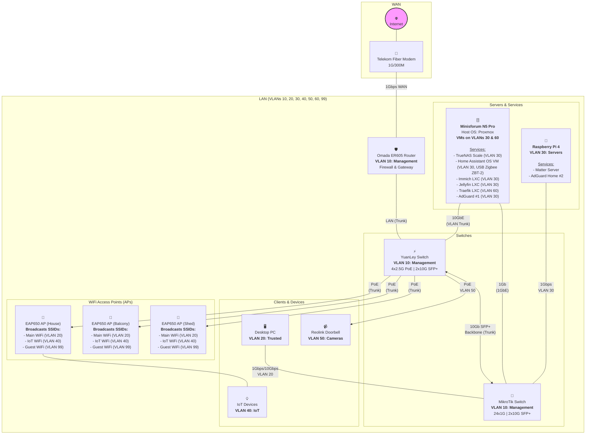

# My Homelab Network Documentation

This document outlines the architecture, services, and configuration of my home network and lab environment. The goal is to maintain a secure, resilient, and high-performance network for both personal use and self-hosting projects.

## 1. Network Philosophy

The network is designed around four core principles:

* **Security:** A segmented VLAN architecture isolates traffic between trusted devices, servers, IoT gadgets, and guests. Firewall rules are implemented with a "deny by default" approach.
* **Resilience:** Critical services are designed with redundancy in mind, including a secondary DNS server and a failover connection for the primary server.
* **Performance:** The network core is a 10Gbps backbone, with dedicated high-speed links for the NAS and primary workstation to handle demanding tasks without bottlenecks.
* **Local Control:** IoT devices are prevented from accessing the internet, forcing all communication through Home Assistant for maximum privacy and security.

---

## 2. Hardware Overview

> **Target design.** This table and the diagram below describe the intended end state (the diagram still predates the ES228GP switch decision - see Section 7). For what is actually deployed today, see Section 7. As of 2026-09-14 the **Omada ER605** is the live router (PPPoE over the bridge-mode Innbox) with all Section 4 VLAN interfaces up. Servers run on VLANs 30 and 60, every client still sits on the transitional VLAN 1, and **1 of the 3 EAP650 access points** is live.

| Role          | Device                           | Key Features                     |
| :------------ | :------------------------------- | :------------------------------- |
| **Router**    | Omada ER605                      | Multi-WAN, VPN, Firewall; gigabit ports only (deployed 2026-09-14 in place of the planned ER707-M2) |
| **Switch 1**  | YuanLey 2.5G PoE (**unmanaged**) | Aggregation only - cannot carry tagged VLANs; verify exact port/SFP+ spec against the physical unit (handoff says 5-port 2.5G PoE, this table previously said 4x2.5G + 2x10G SFP+) |
| **Switch 1a** (planned) | Omada ES228GP | Managed 24x1G PoE+ (250W) + 2x1G SFP - takes over AP/doorbell VLAN trunking |
| **Switch 2**  | MikroTik CSS326-24G-2S+RM        | 24-Port Distribution Switch      |
| **Server 1**  | Minisforum N5 Pro                | Proxmox Host, 1x 10GbE, 1x5GbE   |
| **Server 2**  | Raspberry Pi 4                   | Docker Services + Secondary DNS  |
| **WiFi**      | 3 x Omada EAP650                 | WiFi 6 Access Points             |

---

## 3. Network Diagram

The following diagram illustrates the physical and logical layout of the network, including all devices, connections, and services.

## 4. VLAN Configuration

| VLAN ID | Name             | Subnet            | Purpose                                                       |
| :------ | :--------------- | :---------------- | :------------------------------------------------------------ |
| **10** | Management        | `192.168.10.0/24` | Network infrastructure only (Router, Switches, APs).          |
| **20** | Trusted           | `192.168.20.0/24` | Personal trusted devices (PCs, Laptops, Phones).              |
| **30** | Servers           | `192.168.30.0/24` | Homelab servers and internal services.                        |
| **40** | IoT               | `192.168.40.0/24` | Untrusted smart devices. **No Internet access.**              |
| **50** | Cameras           | `192.168.50.0/24` | Security cameras. **No Internet access.**                     |
| **60** | Public Services   | `192.168.60.0/24` | DMZ for services exposed to the internet (e.g., Traefik).     |
| **99** | Guest             | `192.168.99.0/24` | For visitors. **Internet access only.**                       |

---

## 5. Server Roles

### Minisforum N5 Pro (Proxmox Host)
* **OS:** Proxmox VE
* **Purpose:** Primary hypervisor for running all major services in dedicated VMs.
* **Key VMs & Services:**
    * **Home Assistant OS VM:** A dedicated VM for the core smart home controller. See details below.
    * **TrueNAS Scale VM:** Manages ZFS storage pools and provides network shares.
    * **Docker Host VM:** Hosts containerized services like AdGuard Home, the \*Arr suite, ATProto PDS, etc.
    * **Traefik LXC:** An isolated LXC container for the Traefik reverse proxy in the public-facing VLAN.
    * **Dedicated VMs/LXCs:** For resource-intensive applications like Immich and Jellyfin.

### Home Assistant VM (on N5 Pro)
* **OS:** Home Assistant OS
* **Purpose:** The central controller for all smart home devices and automations.
* **Details:** Runs the full HA OS to get the benefit of the Supervisor and Add-on store, ensuring maximum stability and easy management via Proxmox snapshots. Zigbee is handled via ZHA with a Sonoff ZBT-2 USB coordinator passed through from the Proxmox host.

### Raspberry Pi 4
* **OS:** Raspberry Pi OS Lite (or similar)
* **Purpose:** Docker service host, secondary DNS, and Tailscale subnet router.
* **Key Services:**
    * **Matter Server:** matterjs-server for Thread/Matter device commissioning.
    * **AdGuard Home (Secondary):** Redundant DNS server for network resilience.
    * **Tailscale subnet router:** advertises `192.168.30.0/24` (Servers VLAN,
      approved 2026-09-14) to the `lukaprebil.github` tailnet (tag
      `tag:subnet-router`) so off-LAN peers can reach VLAN-30 hosts, plus
      `192.168.60.142/32` so they reach Traefik in the DMZ without exposing
      the rest of VLAN 60. Tailnet DNS resolvers are `192.168.30.145`
      (AdGuard LXC, via the subnet route) and `100.111.78.53` (AdGuard on
      rpi4, over the tailnet). Devices that stay at home should turn off
      "Use Tailscale subnets", or their server traffic hairpins through rpi4.

---

## 6. Automation & Low-Level Design

This section contains the specific details required for the automated setup and management of the network and services using Ansible.

### Static IP Address Map

This map is the pre-migration flat `192.168.1.0/24` subnet, stranded since the ER605 migration began on 2026-09-14. It is kept as the historical record and as the source for the renumber plan in Section 7.

| Device/Role | Hostname | IP Address |
| :--- | :--- | :--- |
| **Home Router** | `gateway` | `192.168.1.1` |
| **Minisforum N5 Pro** | `n5p` | `192.168.1.128` |
| **Raspberry Pi 4** | `rpi4` | `192.168.1.110` |
| **Docker Host VM** | `containers` | `192.168.1.140` |
| **Immich LXC** | `immich` | `192.168.1.141` |
| **Traefik LXC** | `traefik` | `192.168.1.142` |
| **Omada Controller LXC** | `omada` | `192.168.1.143` |
| **Home Assistant VM** | `haos` | `192.168.1.144` |
| **AdGuard LXC** | `adguard` | `192.168.1.145` |
| **Monitoring LXC** | `monitoring` | `192.168.1.146` |
| **Media LXC** (Jellyfin) | `media` | `192.168.1.147` |
| **Dev VM** | `dev` | `192.168.1.148` |
| **Hermes LXC** | `hermes` | `192.168.1.149` |
| **TrueNAS VM** | `tn-storage` | `192.168.1.150` |
| **SOFAR LSW-3 logger stick** | `sofar-logger` | `192.168.1.6` |
| **Elfin EW11** (heat pump RS485 bridge) | `elfin-heatpump` | `192.168.1.160` |
| **Elfin EE11A** (inverter bridge) | `elfin-inverter` | `192.168.1.161` |
| **Elfin EE11A** (TIGO CCA tap bridge) | `elfin-tigo` | `192.168.1.162` |
| **Desktop PC** | `desktop-pc` | DHCP |

The SOFAR logger stick sits outside the `.140`-`.150` service block because it is a
static lease in the Innbox DHCP table rather than a host-configured static address.
Ports 8899 and 80 are open on it, but it answers no local protocol and is a cloud
uplink only.

The two Elfin EE11A bridges sit at `.161` and `.162`, contiguous with the heat pump's
EW11 at `.160`, so the RS485 bridges read as one group. Each is configured with a static
address on the device **and** a matching DHCP reservation in the Innbox: a static alone
does not stop the router issuing the same address to something else, which is what took
TrueNAS off the network for twenty minutes on 2026-07-22. The TIGO CCA itself still needs
an address recorded.

The **tap bridge** at `.162` is live, serving the optimizer bus as a raw TCP stream on
port 7160; the **inverter bridge** at `.161` is addressed but not yet wired. The two are
easy to confuse and must not be: only the inverter link takes 120 ohm termination, and
terminating the tap would degrade the CCA's own traffic. See
[`hardware/pv-battery-plant.md`](hardware/pv-battery-plant.md).

### Automation Configuration

* **Ansible User:** `ansible_user`
* **Authentication:** SSH key-based authentication.
* **Privilege Escalation:** Granular `sudo` rules to provide least-privilege access for required commands.
* **Filesystem Layout:** Persistent application data will be stored in `/srv/docker/[service_name]`. TrueNAS will manage two primary volumes: one for SSD storage and one for bulk HDD storage.
* **Secrets Management:** All sensitive variables (API keys, passwords) are encrypted with **SOPS** using an **age** recipient, in `ansible/group_vars/all/secrets.sops.yml`. The `community.sops` vars plugin decrypts them transparently for every host. `.sops.yaml` at the repository root holds only the public recipient and is safe to commit; the age private key lives at `~/.config/sops/age/keys.txt` and never enters git. See ADR 0006 for why Ansible Vault was retired.

---

## 7. Implementation Status

### Current Network State

Pre-migration record: until 2026-09-14 the network ran on a flat `192.168.1.0/24` behind the Telekom Innbox (InnboxG93) at `192.168.1.1` (PPPoE over GPON, DHCP, and DNS proxy). Since then the **Omada ER605** is the live router (PPPoE over the bridge-mode Innbox) with all Section 4 VLAN interfaces up; servers run on VLANs 30 and 60, and clients still sit on the transitional VLAN 1 (`192.168.254.0/24`). On 2026-09-16 the ER605 was **adopted into the Omada controller**, so the controller's Home site now owns the router's WAN, LAN networks, DHCP scopes and NAT rules. The site values were staged to match the router's live configuration before the adopt, and the public address is unchanged. Details, decisions, the renumber plan, and sequencing live in **ER605 Migration** below.

### ER605 Migration (started 2026-09-14)

**Live state, verified on the device.** Telekom switched the Innbox G93T to bridge mode (the mode survives a factory reset). ISP side: internet = VLAN 3900 tagged, NEO TV = VLAN 3999 tagged; static public IPv4 kept; IPv6 available over PPPoE (deferred). The ER605 runs PPPoE with **WAN VLAN tagging off** - the bridged Innbox hands PPPoE untagged, so tagging must stay disabled. MTU/MRU 1492, DNS from PPPoE. **NEO TV bypasses the ER605** (verified 2026-09-14): the box plugs into a LAN port on the Innbox itself, which in bridge mode serves TV on its own ports. The ER605 IPTV page was found in Bridge mode with port 4 as the IPTV port, not Custom 3999; the box got no address there or on a normal LAN port, and switching to Custom mode (IPTV VLAN 3999) took the internet down, so it was reverted. ER605 IPTV and IGMP Proxy are both **off** (confirmed 2026-09-16, after adoption replaced the router configuration), so they no longer serve anything.

**Transitional topology.** Servers are on their target VLANs since 2026-09-14 (renumber table below). Every client still sits on the default LAN (VLAN 1, `192.168.254.0/24`) because the YuanLey is unmanaged. The two wired Elfin EE11A bridges moved to VLAN 40 on 2026-09-15; the Wi-Fi EW11 heat-pump bridge and the SOFAR logger stick keep their stranded `192.168.1.x` addresses until an IoT SSID exists (step 8).

**Switch and router state (2026-09-14).** CSS326 (SwOS, management `192.168.254.2`): VLAN 1 on every port; VLAN 30 on p1 (ER605), p2 (n5p) and p24 (rpi4); VLAN 60 on p1 and p2; VLAN 40 on p1 and p15 (a small unmanaged switch in the PV box feeding both EE11A bridges); p2 and p24 run VLAN mode `enabled` with PVID 30, p15 runs `enabled` with PVID 40, all other ports stay `optional` on PVID 1. The ER605 LAN ports already carried every VLAN tagged, so it needed no port change. Port p3 was later set to untagged VLAN 30 access (VLAN mode enabled, PVID 30, a member of VLAN 30) as a wired recovery console that survives a routing failure; it is otherwise unused. p20 feeds the desktop PC.

**Router state (2026-09-16).** The Omada controller's Home site is now the source of truth for the ER605, so the following are site values rather than router settings: the eight VLAN networks with their subnets, gateways, 120-minute leases and manual AdGuard DNS (`192.168.30.145`, `192.168.30.110`), each bound to all four gateway LAN ports; DHCP reservations for rpi4 `.110`, containers `.200` and dev `.201`; WAN TCP 80/443 virtual servers to Traefik at `192.168.60.142`; and WAN Settings Overrides carrying the PPPoE parameters (WAN VLAN tagging off, MTU/MRU 1492, and only the Innbox-facing port marked WAN). Servers (30) uses the `.200-.254` pool so it cannot hand out the `.110-.150` statics, IoT (40) matches it, the other VLANs run `.50-.254`, and VLAN 1 runs `.2-.254`. Config backups from before the change are in the untracked `backups/` directory.

**DNS incident (stopgap in place).** The two AdGuard servers lost their `192.168.1.x` addresses, and Tailscale global nameservers with override-on still pointed at `192.168.1.145`, which hung all DNS on Tailscale clients. Stopgap: the entries were removed from Tailscale DNS and clients resolve through the ER605 DNS proxy.

**Decisions (2026-09-14).**
- The gigabit-only ER605 replaces the planned ER707-M2. Inter-VLAN traffic hairpins the router at 1G - **accepted**; mainly affects desktop <-> TrueNAS bulk transfers.
- VLAN 1 / `192.168.254.0/24` is adopted as the transitional landing net, to be tightened and retired during the switch migration.
- ER605 and EAP650 will be **adopted into the existing Omada Controller LXC** once the controller is reachable on VLAN 30. Adoption re-pushes all config: WAN PPPoE must be recreated controller-side (keep WAN tagging off); IPTV needs no router config because TV runs off the Innbox.
- Planned access switch: **Omada ES228GP** (managed; 24x1G PoE+ 250W, 2x1G SFP) to give the APs and doorbell the VLAN trunking the unmanaged YuanLey cannot. Caveat: its uplinks are 1G, so the 10G YuanLey<->MikroTik backbone does not survive this choice - accepted 2026-09-14, since decision 1 already caps cross-segment traffic at 1G; a 10G-capable managed PoE switch may replace it later.

**Renumber plan.** Last octets are kept so existing references stay recognizable. Ansible inventory, `vars/lxc.yml`, `vars/vms.yml`, host_vars, `known_hosts` pins, role defaults, and the `resolv.conf` template all change together; host-key pins refresh through the provision keyscan / accept-new path.

| Host | Old | New | VLAN |
| :--- | :--- | :--- | :--- |
| n5p (Proxmox) | `192.168.1.128` | `192.168.30.128` | 30 |
| rpi4 | `192.168.1.110` | `192.168.30.110` | 30 |
| containers | `192.168.1.140` | `192.168.30.140` | 30 |
| immich | `192.168.1.141` | `192.168.30.141` | 30 |
| traefik | `192.168.1.142` | `192.168.60.142` | 60 |
| omada | `192.168.1.143` | `192.168.30.143` | 30 |
| haos | `192.168.1.144` | `192.168.30.144` | 30 |
| adguard | `192.168.1.145` | `192.168.30.145` | 30 |
| monitoring | `192.168.1.146` | `192.168.30.146` | 30 |
| media | `192.168.1.147` | `192.168.30.147` | 30 |
| dev | `192.168.1.148` | `192.168.30.148` | 30 |
| hermes | `192.168.1.149` | `192.168.30.149` | 30 |
| tn-storage | `192.168.1.150` | `192.168.30.150` | 30 |
| sofar-logger | `192.168.1.6` | `192.168.40.6` | 40 |
| elfin-heatpump | `192.168.1.160` | `192.168.40.160` | 40 |
| elfin-inverter | `192.168.1.161` | `192.168.40.161` | 40 |
| elfin-tigo | `192.168.1.162` | `192.168.40.162` | 40 |
| desktop-pc | DHCP | DHCP | 20 |

**Target ACL matrix** (deny by default; entries govern the initiator, return traffic is stateful):

| Source | Destination | Service | Verdict |
| :--- | :--- | :--- | :--- |
| Management (10) | any | any | allow |
| any | Servers (30) `.145` / `.110` | UDP+TCP 53 | allow - shared DNS |
| DMZ (60) | Servers (30) | backend ports | allow - Traefik proxies VLAN-30 backends |
| Trusted (20) | Servers (30) | any | allow |
| Trusted (20) | Cameras (50) | any | allow - direct Reolink viewing |
| Servers (30) | IoT (40), Cameras (50) | any | allow - HA initiates; IoT never initiates inward |
| Servers (30) | Internet | any | allow - updates, upstream DNS |
| IoT (40), Cameras (50) | own gateway `.1` | UDP 123 | allow - NTP; no other clock source once internet is denied |
| DMZ (60) | Internet | any | allow |
| WAN | DMZ `.142` | TCP 80/443 | allow via NAT - Traefik |
| Guest (99) | Internet | any | allow |
| Guest (99), IoT (40), Cameras (50), DMZ (60) | other LAN VLANs | any | **deny** (beyond the allows above) |
| any non-Management | Management (10) | any | **deny** |
| VLAN 1 (254), transitional | Internet + DNS | - | allow until retired |

**Sequencing.**
1. This document (done 2026-09-14).
2. Tag VLANs 30/60 on the MikroTik CSS326 server-facing ports so n5p (1G link) and rpi4 land on their target VLANs without new hardware. The CSS326 runs SwOS and is managed (per-port PVID, tagged/untagged, strict VLAN filtering) but ships unconfigured - VLAN mode is off and it has never had an IP, which is why it behaved like an unmanaged switch. Enable VLAN mode first; give it a management IP (later VLAN 10). The n5p-facing port is hybrid: **PVID 30 untagged + VLAN 60 tagged**, so the host address and Servers-VLAN guests ride untagged while Traefik's guest NIC carries the 60 tag - no Proxmox subinterface needed. The YuanLey stays unmanaged with clients on VLAN 1. (Done 2026-09-14; the n5p link runs at 1G.)
3. Renumber the fleet per the table above. (Servers done 2026-09-14; the wired EE11A bridges moved to VLAN 40 on 2026-09-15; the Wi-Fi EW11 and SOFAR stick wait for step 8.) The provision playbooks skip existing guests, so the renumber ran as `pct set` / `qm set` on stopped guests, `midclt` on TrueNAS and `ha network update` on HAOS, with the Proxmox NFS storage repointed while every guest was down.
4. Re-home DNS: AdGuard at `192.168.30.145` / `192.168.30.110`; ER605 per-LAN DHCP hands them out; the "any -> Servers:53" ACL lands before the cut. (Done 2026-09-14: all eight networks hand out both AdGuard servers. No network ACLs are configured yet - the ACL matrix is step 9 - so no allow rule was needed, and the router's default-permit behaviour covers DNS until then.)
5. Tailscale: rpi4 advertises `192.168.30.0/24` (dropping the dead `192.168.1.0/24`); override DNS points at the AdGuard units' **tailnet** IPs, not LAN IPs. (Done 2026-09-14: `192.168.30.0/24` and `192.168.60.142/32` advertised and approved; tailnet DNS resolvers are `192.168.30.145` and `100.111.78.53`.)
6. Verify NEO TV, then disable IGMP Proxy. (TV verified 2026-09-14 on an Innbox LAN port. Done 2026-09-16: IPTV and IGMP Proxy are both off, confirmed in the controller after adoption replaced the router's config.)
7. Controller reachable at `192.168.30.143` -> adopt ER605 and EAP650; recreate PPPoE (TV stays on the Innbox and is unaffected). (ER605 adopted 2026-09-16 with the site pre-staged and WAN Settings Overrides carrying PPPoE; the EAP650 is still in its ADOPTING loop and moves to step 8.)
8. Install ES228GP; move APs/doorbell onto tagged PoE ports; SSID -> VLAN mapping via the controller; tighten VLAN 1 to internet+DNS or retire it.
9. Apply the full ACL matrix.
10. Later: IPv6 via DHCPv6-PD over PPPoE.

### Completed Tasks

#### Hardware
- ✅ YuanLey 4x2.5G PoE Switch deployed
- ✅ MikroTik CSS326 Switch deployed
- ✅ Omada EAP650 Access Point deployed (1x; 2 more planned)
- ✅ Minisforum N5 Pro deployed with 3x 1TB NVMe drives

#### Proxmox Host (n5p)
- ✅ Proxmox VE installed
- ✅ Network bridge (vmbr0) configured with VLAN awareness on interface enp197s0
- ✅ VLAN kernel module (8021q) enabled
- ✅ DNS resolution configured (public DNS servers)
- ✅ Storage configured:
  - `local` - ISOs/backups on boot drive
  - `local-lvm` - VM boot disks (56GB available)
  - `truenas-vms` - VM disks on TrueNAS (200GB NFS)
  - `truenas-templates` - Templates/ISOs on TrueNAS (20GB NFS)
- ✅ Ansible automation user created (`ansible_user`)
- ✅ Admin user created (`luka`)
- ✅ SSH hardening applied (key-only authentication, no password auth)
- ✅ Sudo and privilege escalation configured
- ✅ Timezone set to Europe/Ljubljana
- ✅ Subscription nag removed
- Wake-on-LAN: `wakeonlan <n5p-nic-mac>` (MAC of the n5p primary NIC, requires WoL enabled in BIOS)

#### TrueNAS Storage VM (tn-storage)
- ✅ VM provisioned on Proxmox with PCIe NVMe passthrough
  - 4 CPU cores, 20GB RAM, 32GB boot disk
  - 3x 1TB NVMe drives passed through for ZFS
- ✅ TrueNAS Scale 25.04.2.4 (Fangtooth) installed
- ✅ ZFS pool created:
  - Pool name: `tank`
  - Type: RAIDZ1
  - Capacity: ~2TB usable
- ✅ ZFS datasets configured with quotas:
  - `tank/proxmox-vms` (200GB) - VM disk images
  - `tank/proxmox-templates` (20GB) - Templates/ISOs
  - `tank/docker-volumes` (100GB) - Docker persistent data
  - `tank/media` (no quota) - Media files
  - `tank/backups` (no quota) - System backups
- ✅ NFS shares configured and exported
- ✅ iSCSI target configured:
  - `tank/pds` (20GB zvol) - ATProto PDS block storage (SQLite requires POSIX locking, incompatible with NFS)
  - Backup: use ZFS snapshots on TrueNAS (`zfs snapshot tank/pds@<label>`) - zvols inherit ZFS snapshot/replication capabilities
- ✅ Integrated with Proxmox storage backends

#### Ansible Configuration
- ✅ Directory structure created (`ansible/`)
- ✅ Common role (users, SSH hardening, timezone, sudo)
- ✅ Proxmox role (network bridges, VLAN support, DNS)
- ✅ Inventory and variables configured
- ✅ Secrets encrypted with Ansible Vault
- ✅ Playbooks fully automated and idempotent:
  - `site.yml` - Main playbook (configures Proxmox host)
  - `provision-truenas.yml` - Provisions TrueNAS VM
  - `configure-truenas.yml` - Configures TrueNAS storage (ZFS, NFS, iSCSI, Proxmox integration)
- ✅ TrueNAS API integration via midclt (JSON-RPC)

#### Hardware
- ✅ Raspberry Pi 4 (Docker services + Secondary DNS)

#### Virtual Machines & LXCs
- ✅ TrueNAS Scale VM (192.168.30.150)
- ✅ Home Assistant OS VM (192.168.30.144)
- ✅ Docker Host VM (192.168.30.140)
- ✅ Traefik LXC (192.168.60.142)
- ✅ Immich LXC (192.168.30.141)
- ✅ Omada Controller LXC (192.168.30.143)
- ✅ AdGuard LXC (192.168.30.145, primary DNS)
- ✅ Monitoring LXC (192.168.30.146)
- ✅ Media LXC (192.168.30.147, Jellyfin)
- ⬜ Hermes LXC (declared in IaC and deliberately deferred - not provisioned on n5p, excluded from
  the plays and the Prometheus targets via `unprovisioned_hosts`)
- ✅ Dev VM (192.168.30.148)
- ✅ Cloud-init template playbook
- ✅ Docker Host VM provisioning playbook

#### Services
- ✅ AdGuard Home (DNS filtering, primary + secondary)
- ✅ Home Assistant (HAOS VM with ZHA via USB-passthrough Sonoff ZBT-2 on n5p)
- ✅ Media services (Jellyfin on media LXC)
- ✅ *Arr suite (Sonarr, Radarr, Prowlarr on containers VM)
- ✅ Immich (photo management with GPU acceleration)
- ✅ Traefik Reverse Proxy (serving 8 public routes with Let's Encrypt, rate limiting on all public routes except Home Assistant, which has a login-flow-only limiter)
- ✅ Omada SDN Controller (managing network infrastructure)
- ✅ Monitoring Stack (Prometheus + Grafana + Loki)
- ✅ ATProto PDS (self-hosted Bluesky PDS at pds.lukapg.dev, iSCSI storage from TrueNAS, Cloudflare-proxied, DNS TXT handle verification)
- ✅ CrowdSec IDS (intrusion detection with Traefik bouncer plugin, community blocklists, Grafana dashboard)

#### Security Hardening
- ✅ Cloudflare WAF geo-based challenge on all public subdomains
- ✅ Cloudflare Bot Fight Mode
- ✅ CrowdSec engine parsing Traefik access logs (brute-force, CVE, scanning detection)
- ✅ CrowdSec Traefik bouncer plugin (stream mode, blocks flagged IPs at reverse proxy)
- ✅ CrowdSec community blocklists (Firehol Greensnow, web attacks, Tor exit nodes)
- ✅ traefik-warp plugin (extracts real client IP from Cloudflare proxy headers)
- ✅ Rate limiting on all public routes except Home Assistant (100 req/min, 50 burst; HA login-flow POSTs: 10 req/min, burst 30, keyed on the verified X-Real-Ip)
- ✅ Traefik dashboard removed from public exposure (LAN-only via traefik.lan:8080)
- ✅ MFA (TOTP) on Home Assistant admin account

### Planned

#### Hardware
- ⏳ Omada ES228GP managed PoE switch (planned - see the migration section)
- ⏳ 2 more Omada EAP650 access points

#### Network Migration (tracker: ER605 Migration section above)
- ✅ Deploy Omada router (ER605 instead of the planned ER707-M2, 2026-09-14)
- ✅ Configure VLAN interfaces on router
- ✅ Migrate Proxmox host + guests to VLANs 30/60 (2026-09-14)
- ✅ Adopt ER605 into the Omada Controller LXC (2026-09-16)
- ⏳ Adopt EAP650 into the Omada Controller LXC (stuck in an ADOPTING loop; moved to step 8)
- ⏳ Configure firewall rules (ACL matrix)
- ⏳ Move clients onto real VLANs (ES228GP + SSID mapping)

---

## 8. Physical Rack Layout

This section details the final physical layout of the 7U wall-mounted network rack. The design prioritizes a clean front appearance, logical grouping of hardware, and good airflow. The primary server (Minisforum N5 Pro) is located on top of the cabinet to ensure unrestricted airflow and to remove its weight from the wall mount.

| Unit | Component | Purpose / Notes |
| :--- | :--- | :--- |
| **U7** | 📄 Patch Panel | Terminates all incoming Ethernet drops. Incoming cable loom is routed up the side of the rack to this panel. |
| **U6** | 🔌 MikroTik Switch | Main 24-port distribution switch. Connected to the patch panel with short (0.15m) patch cables. |
| **U5** | ⚡ Custom 1U Mount | Houses the YuanLey PoE Switch and Raspberry Pi 4. Connected to the MikroTik via a 10Gbps SFP+ backbone. |
| **U4** | 🛡️ Omada Router | The main network router and firewall, completing the top-mounted "network block". |
| **U3** | 🖌️ 1U Brush Panel | Provides a clean pass-through for cables running from the modem up to the router's WAN port. |
| **U2** | 📠 Custom 3D Mount | A custom-printed mount for the Telekom Fiber Modem, providing a secure fit and better airflow than a shelf. |
| **U1** | (Open) | Space is kept free for airflow and future expansion. A PDU is mounted vertically on the back rail of this unit. |

