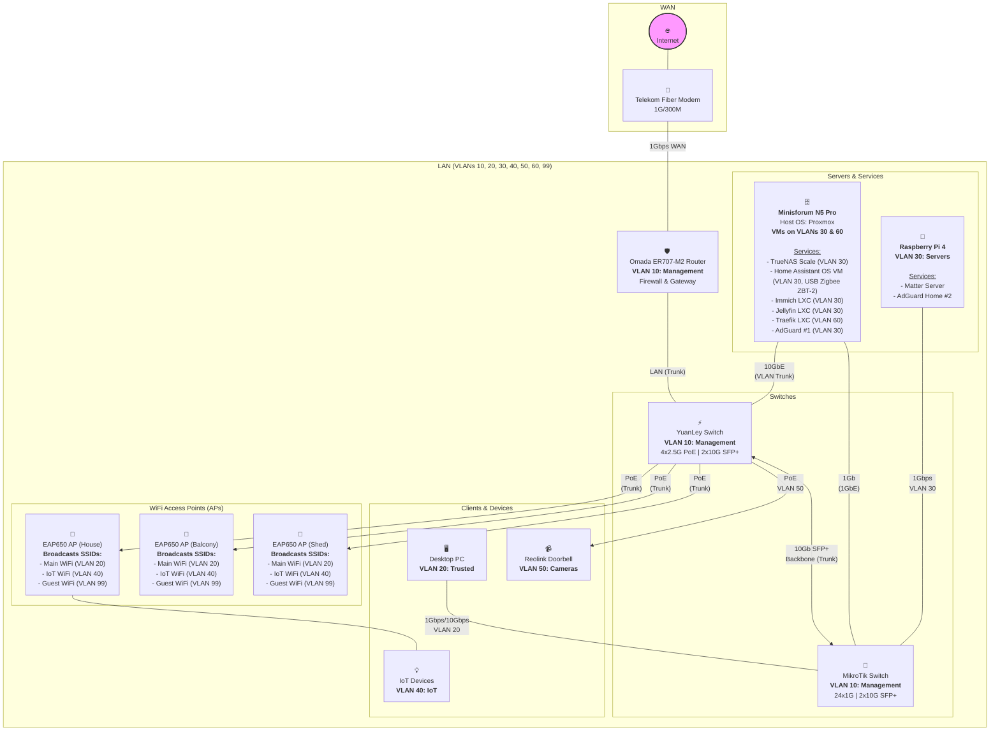

# My Homelab Network Documentation

This document outlines the architecture, services, and configuration of my home network and lab environment. The goal is to maintain a secure, resilient, and high-performance network for both personal use and self-hosting projects.

## 1. Network Philosophy

The network is designed around four core principles:

* **Security:** A segmented VLAN architecture isolates traffic between trusted devices, servers, IoT gadgets, and guests. Firewall rules are implemented with a "deny by default" approach.
* **Resilience:** Critical services are designed with redundancy in mind, including a secondary DNS server and a failover connection for the primary server.
* **Performance:** The network core is a 10Gbps backbone, with dedicated high-speed links for the NAS and primary workstation to handle demanding tasks without bottlenecks.
* **Local Control:** IoT devices are prevented from accessing the internet, forcing all communication through Home Assistant for maximum privacy and security.

---

## 2. Hardware Overview

> **Target design.** This table and the diagram below describe the intended end state. For what is actually deployed today, see Section 7. As of 2026-07 the network still runs behind the **Telekom Innbox (InnboxG93)** as router/gateway (PPPoE over GPON) - the Omada ER707-M2 is not yet deployed - and **1 of the 3 EAP650 access points** is live.

| Role          | Device                           | Key Features                     |
| :------------ | :------------------------------- | :------------------------------- |
| **Router**    | Omada ER707-M2                   | Multi-WAN, VPN, Firewall         |
| **Switch 1**  | YuanLey 4x2.5G PoE + 2x10G SFP+  | High-Speed & PoE Switch          |
| **Switch 2**  | MikroTik CSS326-24G-2S+RM        | 24-Port Distribution Switch      |
| **Server 1**  | Minisforum N5 Pro                | Proxmox Host, 1x 10GbE, 1x5GbE   |
| **Server 2**  | Raspberry Pi 4                   | Docker Services + Secondary DNS  |
| **WiFi**      | 3 x Omada EAP650                 | WiFi 6 Access Points             |

---

## 3. Network Diagram

The following diagram illustrates the physical and logical layout of the network, including all devices, connections, and services.

## 4. VLAN Configuration

| VLAN ID | Name             | Subnet            | Purpose                                                       |
| :------ | :--------------- | :---------------- | :------------------------------------------------------------ |
| **10** | Management        | `192.168.10.0/24` | Network infrastructure only (Router, Switches, APs).          |
| **20** | Trusted           | `192.168.20.0/24` | Personal trusted devices (PCs, Laptops, Phones).              |
| **30** | Servers           | `192.168.30.0/24` | Homelab servers and internal services.                        |
| **40** | IoT               | `192.168.40.0/24` | Untrusted smart devices. **No Internet access.**              |
| **50** | Cameras           | `192.168.50.0/24` | Security cameras. **No Internet access.**                     |
| **60** | Public Services   | `192.168.60.0/24` | DMZ for services exposed to the internet (e.g., Traefik).     |
| **99** | Guest             | `192.168.99.0/24` | For visitors. **Internet access only.**                       |

---

## 5. Server Roles

### Minisforum N5 Pro (Proxmox Host)
* **OS:** Proxmox VE
* **Purpose:** Primary hypervisor for running all major services in dedicated VMs.
* **Key VMs & Services:**
    * **Home Assistant OS VM:** A dedicated VM for the core smart home controller. See details below.
    * **TrueNAS Scale VM:** Manages ZFS storage pools and provides network shares.
    * **Docker Host VM:** Hosts containerized services like AdGuard Home, the \*Arr suite, ATProto PDS, etc.
    * **Traefik LXC:** An isolated LXC container for the Traefik reverse proxy in the public-facing VLAN.
    * **Dedicated VMs/LXCs:** For resource-intensive applications like Immich and Jellyfin.

### Home Assistant VM (on N5 Pro)
* **OS:** Home Assistant OS
* **Purpose:** The central controller for all smart home devices and automations.
* **Details:** Runs the full HA OS to get the benefit of the Supervisor and Add-on store, ensuring maximum stability and easy management via Proxmox snapshots. Zigbee is handled via ZHA with a Sonoff ZBT-2 USB coordinator passed through from the Proxmox host.

### Raspberry Pi 4
* **OS:** Raspberry Pi OS Lite (or similar)
* **Purpose:** Docker service host, secondary DNS, and Tailscale subnet router.
* **Key Services:**
    * **Matter Server:** matterjs-server for Thread/Matter device commissioning.
    * **AdGuard Home (Secondary):** Redundant DNS server for network resilience.
    * **Tailscale subnet router:** advertises `192.168.1.0/24` to the
      `lukaprebil.github` tailnet (tag `tag:subnet-router`) so off-LAN peers
      can reach internal `*.lukapg.dev` services through Traefik. Combined
      with tailnet-level "Override local DNS" → AdGuard `192.168.1.145`,
      this gives roaming clients the same UX as on-LAN.

---

## 6. Automation & Low-Level Design

This section contains the specific details required for the automated setup and management of the network and services using Ansible.

### Static IP Address Map

The network currently runs on a flat `192.168.1.0/24` subnet. The VLAN architecture in Section 4 is the planned target - see "Planned" below.

| Device/Role | Hostname | IP Address |
| :--- | :--- | :--- |
| **Home Router** | `gateway` | `192.168.1.1` |
| **Minisforum N5 Pro** | `n5p` | `192.168.1.128` |
| **Raspberry Pi 4** | `rpi4` | `192.168.1.110` |
| **Docker Host VM** | `containers` | `192.168.1.140` |
| **Immich LXC** | `immich` | `192.168.1.141` |
| **Traefik LXC** | `traefik` | `192.168.1.142` |
| **Omada Controller LXC** | `omada` | `192.168.1.143` |
| **Home Assistant VM** | `haos` | `192.168.1.144` |
| **AdGuard LXC** | `adguard` | `192.168.1.145` |
| **Monitoring LXC** | `monitoring` | `192.168.1.146` |
| **Media LXC** (Jellyfin) | `media` | `192.168.1.147` |
| **Dev VM** | `dev` | `192.168.1.148` |
| **Hermes LXC** | `hermes` | `192.168.1.149` |
| **TrueNAS VM** | `tn-storage` | `192.168.1.150` |
| **Desktop PC** | `desktop-pc` | DHCP |

### Automation Configuration

* **Ansible User:** `ansible_user`
* **Authentication:** SSH key-based authentication.
* **Privilege Escalation:** Granular `sudo` rules to provide least-privilege access for required commands.
* **Filesystem Layout:** Persistent application data will be stored in `/srv/docker/[service_name]`. TrueNAS will manage two primary volumes: one for SSD storage and one for bulk HDD storage.
* **Secrets Management:** All sensitive variables (API keys, passwords) will be encrypted and stored locally using **Ansible Vault**.

---

## 7. Implementation Status

### Current Network State

The network runs on a flat `192.168.1.0/24` subnet using the **Telekom Innbox (InnboxG93)** router/gateway at `192.168.1.1` (PPPoE over GPON; it is also the DHCP server and hands out itself as the client DNS server). All services are accessible on their assigned IPs listed in Section 6. The VLAN architecture defined in Section 4 is the planned target - migration will happen when the Omada ER707-M2 router is deployed.

### Completed Tasks

#### Hardware
- ✅ YuanLey 4x2.5G PoE Switch deployed
- ✅ MikroTik CSS326 Switch deployed
- ✅ Omada EAP650 Access Point deployed (1x; 2 more planned)
- ✅ Minisforum N5 Pro deployed with 3x 1TB NVMe drives

#### Proxmox Host (n5p)
- ✅ Proxmox VE installed
- ✅ Network bridge (vmbr0) configured with VLAN awareness on interface enp197s0
- ✅ VLAN kernel module (8021q) enabled
- ✅ DNS resolution configured (public DNS servers)
- ✅ Storage configured:
  - `local` - ISOs/backups on boot drive
  - `local-lvm` - VM boot disks (56GB available)
  - `truenas-vms` - VM disks on TrueNAS (200GB NFS)
  - `truenas-templates` - Templates/ISOs on TrueNAS (20GB NFS)
- ✅ Ansible automation user created (`ansible_user`)
- ✅ Admin user created (`luka`)
- ✅ SSH hardening applied (key-only authentication, no password auth)
- ✅ Sudo and privilege escalation configured
- ✅ Timezone set to Europe/Ljubljana
- ✅ Subscription nag removed
- Wake-on-LAN: `wakeonlan <n5p-nic-mac>` (MAC of the n5p primary NIC, requires WoL enabled in BIOS)

#### TrueNAS Storage VM (tn-storage)
- ✅ VM provisioned on Proxmox with PCIe NVMe passthrough
  - 4 CPU cores, 20GB RAM, 32GB boot disk
  - 3x 1TB NVMe drives passed through for ZFS
- ✅ TrueNAS Scale 25.04.2.4 (Fangtooth) installed
- ✅ ZFS pool created:
  - Pool name: `tank`
  - Type: RAIDZ1
  - Capacity: ~2TB usable
- ✅ ZFS datasets configured with quotas:
  - `tank/proxmox-vms` (200GB) - VM disk images
  - `tank/proxmox-templates` (20GB) - Templates/ISOs
  - `tank/docker-volumes` (100GB) - Docker persistent data
  - `tank/media` (no quota) - Media files
  - `tank/backups` (no quota) - System backups
- ✅ NFS shares configured and exported
- ✅ iSCSI target configured:
  - `tank/pds` (20GB zvol) - ATProto PDS block storage (SQLite requires POSIX locking, incompatible with NFS)
  - Backup: use ZFS snapshots on TrueNAS (`zfs snapshot tank/pds@<label>`) - zvols inherit ZFS snapshot/replication capabilities
- ✅ Integrated with Proxmox storage backends

#### Ansible Configuration
- ✅ Directory structure created (`ansible/`)
- ✅ Common role (users, SSH hardening, timezone, sudo)
- ✅ Proxmox role (network bridges, VLAN support, DNS)
- ✅ Inventory and variables configured
- ✅ Secrets encrypted with Ansible Vault
- ✅ Playbooks fully automated and idempotent:
  - `site.yml` - Main playbook (configures Proxmox host)
  - `provision-truenas.yml` - Provisions TrueNAS VM
  - `configure-truenas.yml` - Configures TrueNAS storage (ZFS, NFS, iSCSI, Proxmox integration)
- ✅ TrueNAS API integration via midclt (JSON-RPC)

#### Hardware
- ✅ Raspberry Pi 4 (Docker services + Secondary DNS)

#### Virtual Machines & LXCs
- ✅ TrueNAS Scale VM (192.168.1.150)
- ✅ Home Assistant OS VM (192.168.1.144)
- ✅ Docker Host VM (192.168.1.140)
- ✅ Traefik LXC (192.168.1.142)
- ✅ Immich LXC (192.168.1.141)
- ✅ Omada Controller LXC (192.168.1.143)
- ✅ AdGuard LXC (192.168.1.145, primary DNS)
- ✅ Monitoring LXC (192.168.1.146)
- ✅ Media LXC (192.168.1.147, Jellyfin)
- ✅ Hermes LXC (192.168.1.149)
- ✅ Dev VM (192.168.1.148)
- ✅ Cloud-init template playbook
- ✅ Docker Host VM provisioning playbook

#### Services
- ✅ AdGuard Home (DNS filtering, primary + secondary)
- ✅ Home Assistant (HAOS VM with ZHA via USB-passthrough Sonoff ZBT-2 on n5p)
- ✅ Media services (Jellyfin on media LXC)
- ✅ *Arr suite (Sonarr, Radarr, Prowlarr on containers VM)
- ✅ Immich (photo management with GPU acceleration)
- ✅ Traefik Reverse Proxy (serving 8 public routes with Let's Encrypt, rate limiting on all routes)
- ✅ Omada SDN Controller (managing network infrastructure)
- ✅ Monitoring Stack (Prometheus + Grafana + Loki)
- ✅ ATProto PDS (self-hosted Bluesky PDS at pds.lukapg.dev, iSCSI storage from TrueNAS, Cloudflare-proxied, DNS TXT handle verification)
- ✅ CrowdSec IDS (intrusion detection with Traefik bouncer plugin, community blocklists, Grafana dashboard)

#### Security Hardening
- ✅ Cloudflare WAF geo-based challenge on all public subdomains
- ✅ Cloudflare Bot Fight Mode
- ✅ CrowdSec engine parsing Traefik access logs (brute-force, CVE, scanning detection)
- ✅ CrowdSec Traefik bouncer plugin (stream mode, blocks flagged IPs at reverse proxy)
- ✅ CrowdSec community blocklists (Firehol Greensnow, web attacks, Tor exit nodes)
- ✅ traefik-warp plugin (extracts real client IP from Cloudflare proxy headers)
- ✅ Rate limiting on all public routes (100 req/min, 50 burst)
- ✅ Traefik dashboard removed from public exposure (LAN-only via traefik.lan:8080)
- ✅ MFA (TOTP) on Home Assistant admin account

### Planned

#### Hardware
- ⏳ Omada ER707-M2 Router (not yet deployed)

#### Network Migration (blocked on router deployment)
- ⏳ Deploy Omada router
- ⏳ Configure VLANs on router
- ⏳ Migrate Proxmox host to VLAN 30
- ⏳ Configure firewall rules
- ⏳ Set up inter-VLAN routing

---

## 8. Physical Rack Layout

This section details the final physical layout of the 7U wall-mounted network rack. The design prioritizes a clean front appearance, logical grouping of hardware, and good airflow. The primary server (Minisforum N5 Pro) is located on top of the cabinet to ensure unrestricted airflow and to remove its weight from the wall mount.

| Unit | Component | Purpose / Notes |
| :--- | :--- | :--- |
| **U7** | 📄 Patch Panel | Terminates all incoming Ethernet drops. Incoming cable loom is routed up the side of the rack to this panel. |
| **U6** | 🔌 MikroTik Switch | Main 24-port distribution switch. Connected to the patch panel with short (0.15m) patch cables. |
| **U5** | ⚡ Custom 1U Mount | Houses the YuanLey PoE Switch and Raspberry Pi 4. Connected to the MikroTik via a 10Gbps SFP+ backbone. |
| **U4** | 🛡️ Omada Router | The main network router and firewall, completing the top-mounted "network block". |
| **U3** | 🖌️ 1U Brush Panel | Provides a clean pass-through for cables running from the modem up to the router's WAN port. |
| **U2** | 📠 Custom 3D Mount | A custom-printed mount for the Telekom Fiber Modem, providing a secure fit and better airflow than a shelf. |
| **U1** | (Open) | Space is kept free for airflow and future expansion. A PDU is mounted vertically on the back rail of this unit. |

