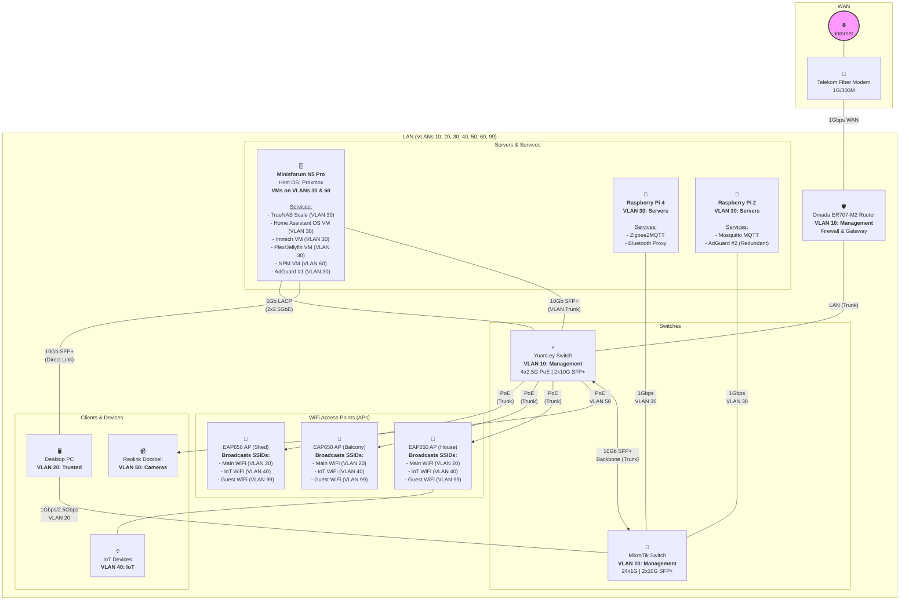
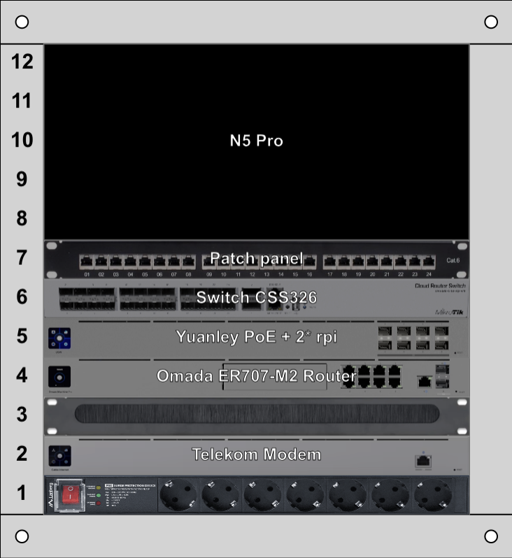

# My Homelab Network Documentation

This document outlines the architecture, services, and configuration of my home network and lab environment. The goal is to maintain a secure, resilient, and high-performance network for both personal use and self-hosting projects.

## 1. Network Philosophy

The network is designed around four core principles:

* **Security:** A segmented VLAN architecture isolates traffic between trusted devices, servers, IoT gadgets, and guests. Firewall rules are implemented with a "deny by default" approach.
* **Resilience:** Critical services are designed with redundancy in mind, including a secondary DNS server and a failover LACP bond for the primary server.
* **Performance:** The network core is a 10Gbps backbone, with dedicated high-speed links for the NAS and primary workstation to handle demanding tasks without bottlenecks.
* **Local Control:** IoT devices are prevented from accessing the internet, forcing all communication through Home Assistant for maximum privacy and security.

---

## 2. Hardware Overview

| Role          | Device                           | Key Features                     |
| :------------ | :------------------------------- | :------------------------------- |
| **Router**    | Omada ER707-M2                   | Multi-WAN, VPN, Firewall         |
| **Switch 1**  | YuanLey 4x2.5G PoE + 2x10G SFP+  | High-Speed & PoE Switch          |
| **Switch 2**  | MikroTik CSS326-24G-2S+RM        | 24-Port Distribution Switch      |
| **Server 1**  | Minisforum N5 Pro                | Proxmox Host, 2xSFP+, 2x2.5GbE   |
| **Server 2**  | Raspberry Pi 4                   | Zigbee & Bluetooth Hub           |
| **Server 3**  | Raspberry Pi 2                   | MQTT & Redundant DNS             |
| **WiFi**      | 3 x Omada EAP650                 | WiFi 6 Access Points             |

---

## 3. Network Diagram

The following diagram illustrates the physical and logical layout of the network, including all devices, connections, and services.

## 4. VLAN Configuration

| VLAN ID | Name             | Subnet            | Purpose                                                       |
| :------ | :--------------- | :---------------- | :------------------------------------------------------------ |
| **10** | Management        | `192.168.10.0/24` | Network infrastructure only (Router, Switches, APs).          |
| **20** | Trusted           | `192.168.20.0/24` | Personal trusted devices (PCs, Laptops, Phones).              |
| **30** | Servers           | `192.168.30.0/24` | Homelab servers and internal services.                        |
| **40** | IoT               | `192.168.40.0/24` | Untrusted smart devices. **No Internet access.**              |
| **50** | Cameras           | `192.168.50.0/24` | Security cameras. **No Internet access.**                     |
| **60** | Public Services   | `192.168.60.0/24` | DMZ for services exposed to the internet (e.g., NPM).         |
| **99** | Guest             | `192.168.99.0/24` | For visitors. **Internet access only.**                       |

---

## 5. Server Roles

### Minisforum N5 Pro (Proxmox Host)
* **OS:** Proxmox VE
* **Purpose:** Primary hypervisor for running all major services in dedicated VMs.
* **Key VMs & Services:**
    * **Home Assistant OS VM:** A dedicated VM for the core smart home controller. See details below.
    * **TrueNAS Scale VM:** Manages ZFS storage pools and provides network shares.
    * **Docker Host VM:** Hosts containerized services like AdGuard Home, the \*Arr suite, etc.
    * **NPM VM:** An isolated VM for the Nginx Proxy Manager in the public-facing VLAN.
    * **Dedicated VMs/LXCs:** For resource-intensive applications like Immich and Plex/Jellyfin.

### Home Assistant VM (on N5 Pro)
* **OS:** Home Assistant OS
* **Purpose:** The central controller for all smart home devices and automations.
* **Details:** Runs the full HA OS to get the benefit of the Supervisor and Add-on store, ensuring maximum stability and easy management via Proxmox snapshots.

### Raspberry Pi 4
* **OS:** Raspberry Pi OS Lite (or similar)
* **Purpose:** Dedicated hub for physical smart home radio protocols.
* **Key Services:**
    * **Zigbee2MQTT:** Manages the Zigbee mesh network via the Sonoff ZBDongle-E.
    * **Bluetooth Proxy:** Extends Home Assistant's Bluetooth range.

### Raspberry Pi 2
* **OS:** Raspberry Pi OS Lite (or similar)
* **Purpose:** Runs lightweight, high-availability services.
* **Key Services:**
    * **Mosquitto:** The central MQTT broker for all IoT communication.
    * **AdGuard Home (Secondary):** Acts as a redundant DNS server for network-wide resilience.

---

## 6. Automation & Low-Level Design

This section contains the specific details required for the automated setup and management of the network and services using Ansible.

### Static IP Address Map

| Device/Role | Hostname | VLAN | Static IP Address |
| :--- | :--- | :--- | :--- |
| **Omada Router** | `gateway` | N/A | `192.168.10.1`, `192.168.20.1`, etc. |
| **Minisforum N5 Pro** | `n5p` | 30 (Servers) | `192.168.30.2` |
| **TrueNAS VM** | `tn-storage` | 30 (Servers) | `192.168.30.3` |
| **Docker Host VM** | `containers` | 30 (Servers) | `192.168.30.4` |
| **NPM VM** | `nginx` | 60 (Public) | `192.168.60.2` |
| **Raspberry Pi 4** | `rpi4` | 30 (Servers) | `192.168.30.5` |
| **Raspberry Pi 2** | `rpi2` | 30 (Servers) | `192.168.30.6` |
| **Home Assistant VM** | `haos` | 30 (Servers) | `192.168.30.7` |
| **Desktop PC** | `desktop-pc` | 20 (Trusted) | `192.168.20.2` |

### Automation Configuration

* **Ansible User:** `ansible_user`
* **Authentication:** SSH key-based authentication.
* **Privilege Escalation:** Granular `sudo` rules to provide least-privilege access for required commands.
* **Filesystem Layout:** Persistent application data will be stored in `/srv/docker/[service_name]`. TrueNAS will manage two primary volumes: one for SSD storage and one for bulk HDD storage.
* **Secrets Management:** All sensitive variables (API keys, passwords) will be encrypted and stored locally using **Ansible Vault**.

## 7. Physical Rack Layout

This section details the final physical layout of the 7U wall-mounted network rack. The design prioritizes a clean front appearance, logical grouping of hardware, and good airflow. The primary server (Minisforum N5 Pro) is located on top of the cabinet to ensure unrestricted airflow and to remove its weight from the wall mount.

| Unit | Component | Purpose / Notes |
| :--- | :--- | :--- |
| **U7** | 📄 Patch Panel | Terminates all incoming Ethernet drops. Incoming cable loom is routed up the side of the rack to this panel. |
| **U6** | 🔌 MikroTik Switch | Main 24-port distribution switch. Connected to the patch panel with short (0.15m) patch cables. |
| **U5** | ⚡ Custom 1U Mount | Houses the YuanLey PoE Switch and both Raspberry Pis. Connected to the MikroTik via a 10Gbps SFP+ backbone. |
| **U4** | 🛡️ Omada Router | The main network router and firewall, completing the top-mounted "network block". |
| **U3** | 🖌️ 1U Brush Panel | Provides a clean pass-through for cables running from the modem up to the router's WAN port. |
| **U2** | 📠 Custom 3D Mount | A custom-printed mount for the Telekom Fiber Modem, providing a secure fit and better airflow than a shelf. |
| **U1** | (Open) | Space is kept free for airflow and future expansion. A PDU is mounted vertically on the back rail of this unit. |

